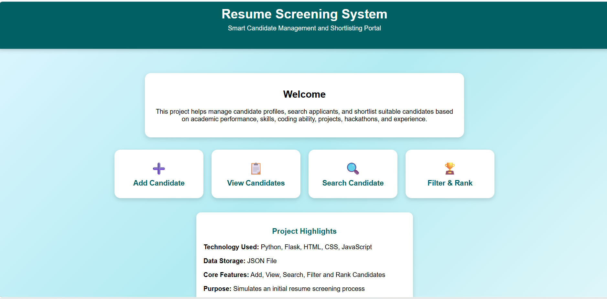
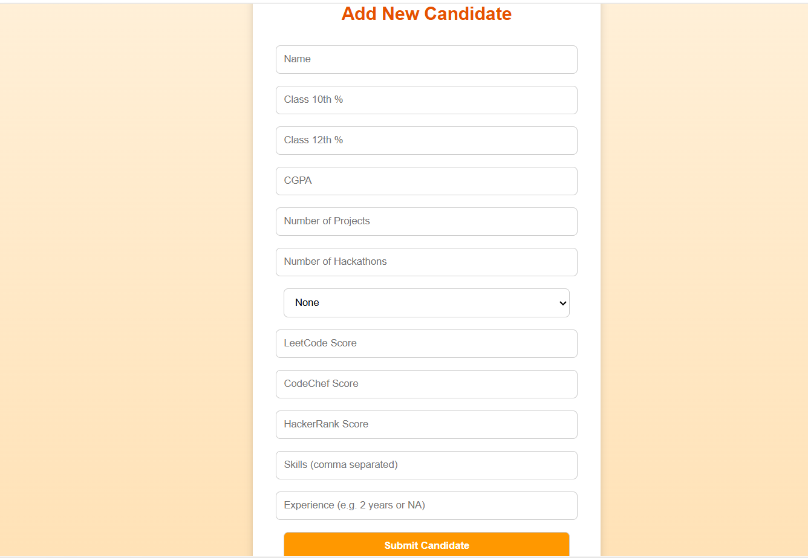
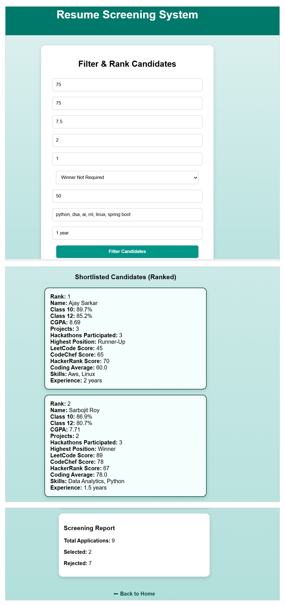

# Resume Screening System

A Flask-based web application to manage and screen candidate resumes using structured filtering and ranking logic.

## 🚀 Features

- Add Candidate Profiles
- View All Candidates
- Search by ID or Name
- Filter and Rank Candidates
- Coding Average Calculation
- Screening Report (Total Number of Selected and Rejected Candidates)

## 🛠️ Tech Stack

- Python (Flask)
- HTML, CSS, JavaScript
- JSON (Data Storage)

## 🎯 Use Case

Simulates a basic recruiter workflow to shortlist candidates based on:
- Academic performance
- Number of Projects and hackathons
- Coding platform scores
- Skills matching
- Experience 

## ▶️ How to Run

1. Install dependencies:
- pip install flask

2. Run the web app:
- python resume_webapp.py

## 📸 Screenshots

### 🏠 Home Page

### ➕ Add Candidate

### 📊 View Candidates

### 🔍 Search Candidate

### ⚙️ Filter & Rank

### 🏆 Ranking Output

