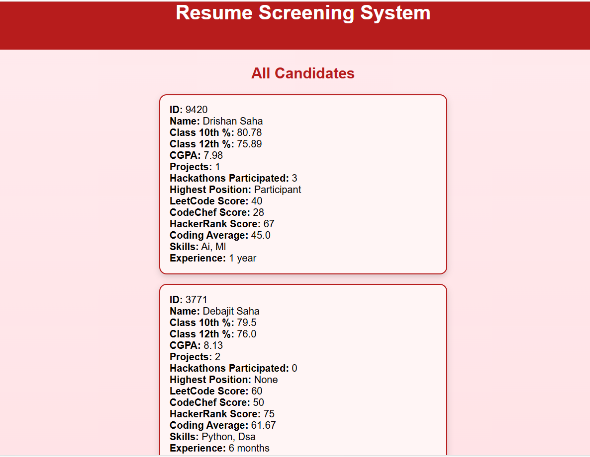
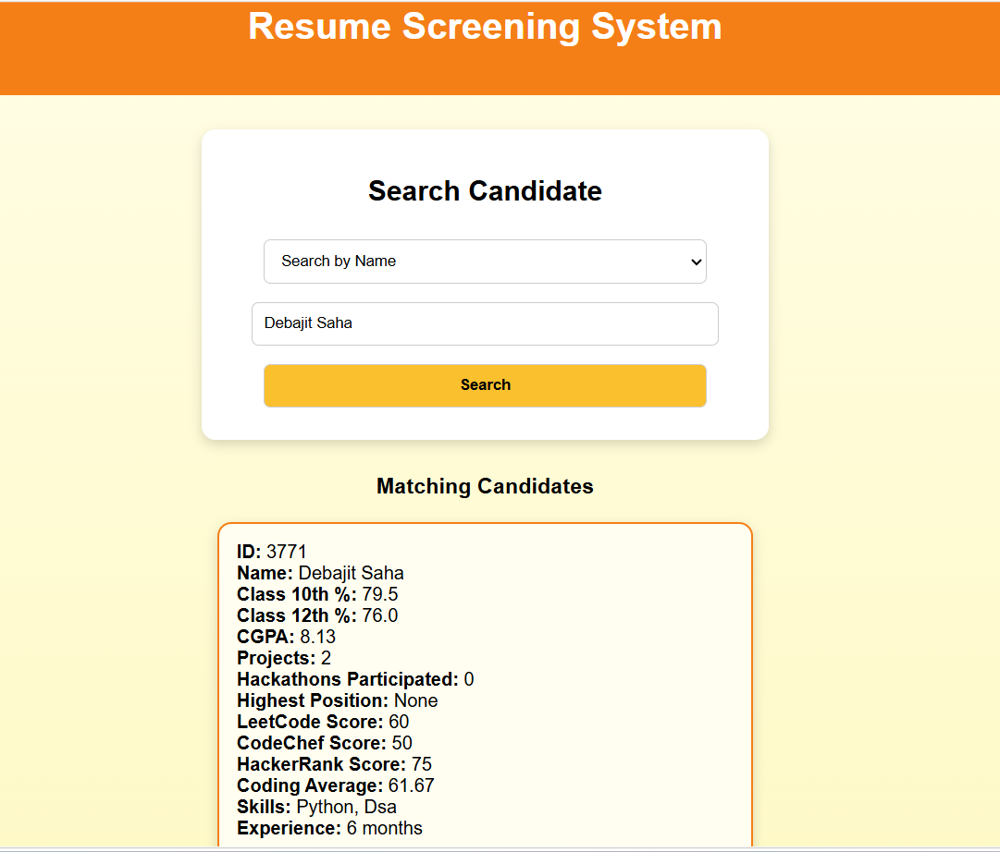
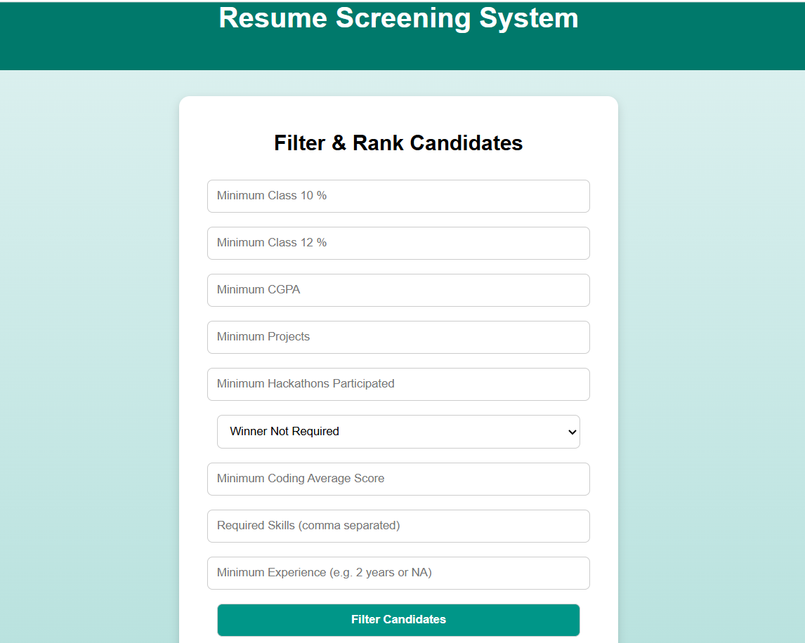

# Resume Screening System

- A Python Flask-based web application that simulates a basic recruitment workflow by managing, filtering, and ranking candidate resumes using structured rule-based logic.
- This project helps simulate how recruiters shortlist candidates based on structured scoring logic.

## 🚀 Features

- ➕ Add candidate profiles with academic and skill details
- 📋 View all registered candidates
- 🔍 Search candidates by ID or Name
- 🎯 Filter and rank candidates based on performance metrics
- 🧮 Automatic coding score average calculation
- 📊 Screening report showing:
  - Total selected candidates
  - Total rejected candidates

## 🧠 Evaluation Criteria

Candidates are evaluated based on:

- Academic performance (CGPA / marks)
- Number of projects
- Hackathon participation
- Coding platform scores
- Technical skills
- Experience

## 🛠️ Tech Stack

- Backend: Python (Flask)
- Frontend: HTML, CSS, JavaScript
- Data Storage: JSON (file-based system)

## 📁 Project Structure

- Resume Screening System/
  - resume_webapp.py
  - templates/
  - static/
  - candidates.json
  - Screenshot/
  - README.md
 
    
## ▶️ How to Run

1. Install dependencies:
- pip install flask

2. Run the web app:
- python resume_webapp.py

## 📸 Screenshots

### 🏠 Home Page

### ➕ Add Candidate

### 📊 View Candidates

### 🔍 Search Candidate

### ⚙️ Filter & Rank

### 🏆 Ranking Output

